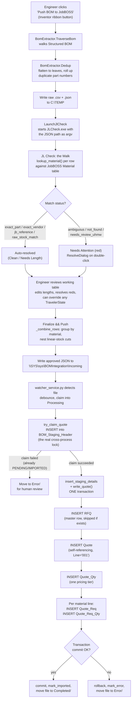

# Architecture Reference — InventorToJobBoss

What this system does, how each stage works, and — critically — *why*
it works that way. Written to be the thing you reopen six months from
now instead of re-deriving a decision from scratch.

For the day-to-day mechanics of branching/building/deploying, see
`FEATURE_WORKFLOW.md`. This doc is about the system itself.

---

## The problem this solves

An engineer finishes an Inventor assembly. Getting its bill of
materials into a JobBOSS quote used to mean manually reading the BOM
off the model and re-keying every part number, quantity, and cut
length into the JobBOSS client by hand — slow, and every re-key is a
chance to transpose a digit on a real quote.

This system automates that path end to end, with one deliberate
human-in-the-loop checkpoint in the middle: the BOM is extracted and
matched against JobBOSS's material library automatically, but nothing
is ever written to JobBOSS until an engineer has reviewed and approved
it in JL Check. Full automation of the *matching*, a hard stop before
the *writing*.

---

## Pipeline overview

---

## Stage by stage

### 1. Inside Inventor — extraction (`BomPushAddIn`)

**Entry point:** `StandardAddInServer.OnPushBomButton`, wired to a
ribbon button under Assembly → Tools. The button click handler is
intentionally thin — it just orchestrates three calls into
`BomExtractor` and writes two files.

**`BomExtractor.TraverseBom`** walks Inventor's *Structured* BOM view
(not the default view — structured mode is required for
`ChildRows` to populate at all; without `StructuredViewFirstLevelOnly =
False`, the walk silently flattens to the top level). It builds a tree
of `BomLineItem`, computing **effective quantities**: each row's own
`ItemQuantity` multiplied by every parent sub-assembly's quantity, so
a part used once inside a sub-assembly instanced 8 times correctly
reports `Quantity = 8`, not `1`.

**`BomExtractor.Dedup`** does two things in one pass:
1. **Flattens to leaves only** — sub-assembly container rows are
   dropped entirely. A quote line item is a physical part, not a CAD
   grouping; nobody orders "sub-assembly #3," they order its contents.
2. **Rolls up duplicate part numbers** across the whole tree, summing
   quantities. A part appearing in three different sub-assemblies
   becomes one row with the combined total.

   Parts with **no part number at all** (common for vendor hardware,
   where only the `Material` iProperty carries the vendor's stock
   number) can't be grouped by part number — grouping them all under
   one blank key would collapse *every* such part into a single bogus
   row. They're grouped by `Description` instead, and every such row
   is flagged (`HasConflict = True`) for review downstream.

   Material disagreements within a group (the same part number
   reporting two different `Material` values across occurrences —
   symptomatic of an `.iam`/`.ipt` mismatch upstream) are **surfaced,
   never silently resolved**. This was a deliberate choice: picking
   "first occurrence wins" for a genuine data-integrity problem would
   hide a real modeling error instead of catching it.

   *Known gap, documented as a live `TODO` in the source:* the same
   conflict check isn't yet applied to `CutLengthIn` — a duplicate part
   number with differing lengths across occurrences currently collapses
   silently to the first occurrence's length. Worth resolving before
   this ever bites a real nested cut list.

**Category detection** (`DetectCategory`) only recognizes `TUBE`,
`ROUND BAR`, and `BAR` from the `Material` string at extraction time.
`SHEET`, `PLATE`, and `ANGLE` are deliberately *not* detected here —
that classification happens later, in JL Check (`classify_secondary_
category`), during the walk. Splitting it this way means the Inventor
add-in doesn't need updating every time a new secondary category
matters to the JobBOSS matching logic — only the Python side does.

**Cut length** (`TryGetLengthInches`) tries a "length" **User Defined
Property** first (already stored as a formatted inch string like
`"34.750 in"` — regex-extracted and parsed), falling back to a
`LENGTH` **model parameter** (Inventor's internal unit is centimeters,
converted via `/ 2.54`). Returns `0` if neither exists, which is
expected and harmless for legacy bar-stock library parts predating
length tracking.

**Output:** two files, named from the assembly's own filename (not a
fixed constant — otherwise every push overwrites the same file, and
worse, the quote number JL Check later derives from the filename would
never reflect which assembly was actually pushed). Written to
`C:\TEMP` — deliberately **not** the same folder the watcher service
watches. This raw, unresolved extraction is a completely different
trust level from a finalized, human-approved export; keeping them in
physically separate folders makes it structurally impossible for raw
data to accidentally reach the watcher.

**`LaunchJlCheck`** starts `JLCheck.exe` (the PyInstaller-packaged
build, loaded live from the shared `Releases\BOMFormatter` location —
no per-engineer Python install required) with the JSON path as its
only argument.

---

### 2. JL Check — the walk (automated matching)

**Entry:** `main()` reads `sys.argv[1]` as the BOM JSON path,
constructs `MainWindow`, shows it, *then* calls `load_file()` — in
that order specifically, so the walk's progress sweep and progress bar
are painting against a window that's actually visible, not racing
ahead of the first repaint.

**`load_file`** first checks for a previously saved session matching
this same source filename (see *Session persistence* below) — offering
to resume rather than re-walking from scratch. On a fresh load, every
row gets a stable `_orig_index` before anything else happens; this is
what lets the two panels (base/working) stay row-for-row aligned
through any amount of later sorting or row substitution — the panels
are never assumed to be in the same order, they're explicitly kept in
sync *by* that index.

**`start_walk`** iterates every row and calls `lookup_material()` —
the core matching function, in `jobboss_lookup.py`. Runs on the UI
thread with an explicit `QApplication.processEvents()` per row rather
than a worker thread: each lookup is a fast, local query against a
small table, and the added complexity of a threaded walk (marshaling
results back to the UI, cancellation handling) wasn't worth it for
something this fast. The `processEvents()` call is what lets the green
sweep highlight and progress bar actually paint mid-loop — without it,
the whole walk would run to completion before a single frame renders.

#### The matching logic (`jobboss_lookup.lookup_material`)

Two fundamentally different kinds of part number, handled differently
from the start:

- **Job-specific** part numbers — three all-numeric segments
  (`28179-05-012`, job-subassembly-item). These can **never** exist as
  their own JobBOSS material record — they're unique to one job. Every
  part-number-based lookup step is skipped for these; they resolve
  through the `Material` field alone.
- **Standard** part numbers — everything else (letters in a suffix,
  vendor-style two-segment numbers). These go through the full chain
  below.

**Match priority, in order:**
1. **Exact match** on the part number itself against `Material.Material`.
2. **Exact match** on the vendor number (the `Material` field, with a
   `"VENDOR "` prefix stripped if present).
3. **Embedded `JB#` reference** in the description — an engineer can
   deliberately write `"(JB# 028-381)"` into a part's description as a
   trusted cross-reference. Fully trusted if the referenced number
   exists; falls through (not trusted blindly) if it doesn't.
4. **Raw-stock extraction** — for `SHEET`/`PLATE`/`TUBE`/`ANGLE`
   shape-coded `Material` strings that end in an actual JobBOSS
   material number (e.g. `"SS SH 10GA X 48 X 120 T304 2B 28-0003"` ->
   `"28-0003"`). **UHMW is excluded from this path entirely,
   regardless of shape code** — always routed to a human, because a
   UHMW part can carry a `SH`/`PL` shape code without actually being
   sheet-metal-team material, and getting that wrong would silently
   misroute a part that needs its own review.
5. **Progressive prefix search** — for standard parts only, truncates
   the part number at each trailing hyphen segment (never below two
   segments — a single-segment search returns far too much noise to
   be useful) and searches for near-miss matches. Also acts as a
   **gate** on step 4's result for non-sheet/plate items: even when
   raw-stock extraction found a match, a human confirms the part
   doesn't secretly exist as its own material under a slightly
   different suffix first. **Sheet/plate skip this gate** — they're
   dropped from the export regardless of which exact material they
   resolve to (see below), so precision there doesn't matter, and
   gating them only risked flipping a perfectly good match into a
   false "ambiguous" flag.

If nothing matches at all: `not_found`, full manual resolution
required.

#### TravelerState — the single source of truth for row status

Every row's color/behavior in JL Check is derived by
`traveler_state.compute_traveler_state`, a pure function re-run on
every edit rather than patched incrementally — this was a deliberate
choice after real bugs traced to rules firing in the *wrong order*
(see below). Current rule order, each one able to short-circuit
everything after it:

0. **Manual override** (`ManualTravelerState`, set via right-click)
   always wins — an engineer's explicit call is never second-guessed
   by the automatic derivation.
1. **`manually_ignored`** -> Ignored.
2. **`custom_line`** -> Custom (blue). Set once at creation, never
   recomputed off any other field.
3. **`PartNumber == "NA"`** -> Needs Attention, unconditionally — even
   if the vendor number happened to resolve cleanly. A missing part
   number is itself worth a human glance regardless of how well the
   rest matched.
4. **`needs_review_uhmw`** -> Needs Attention, unconditionally. Must be
   checked *before* the SHEET/PLATE rule below — a real bug, since
   fixed, had a UHMW part carrying a `SH` shape code getting silently
   swallowed into auto-Ignored instead of surfacing for review, because
   the category check ran first.
5. **`SHEET`/`PLATE`** category -> Ignored (handled by the sheet metal
   team through a separate process) — **unless** the part resolved via
   an *exact* JobBOSS match (`exact_part`/`exact_vendor`/`jb_reference`
   — not `raw_stock_match`, which is inferred from a description, not
   a confirmed hit). An exact-matched sheet/plate part is a real,
   standalone JobBOSS material and should flow into the export, not
   get dropped just because of its category.
6. **Unresolved statuses** (`ambiguous`, `needs_review_uhmw`,
   `not_found`) -> Needs Attention.
7. **Linear-stock categories with a raw-stock match and no length yet**
   -> Needs Length (orange) — resolved by typing a value directly into
   the working table.
8. Otherwise: **Attended** (a human touched it) or **Clean**
   (auto-matched, no human involvement).

#### Manual resolution (`ResolveDialog`)

Opens on double-click for red rows, or on-demand via right-click ->
"Resolve..." for *any* row (deliberately ungated there — the way to
re-open resolution on an already-clean line to fix a bad match after
the fact). Two tabs: **Candidates** (pre-populated from whatever the
automatic lookup already found — the common case for an "ambiguous"
result is that the right answer is already sitting in this list) and
**Search** (a manual query against `Material`, with a client-side
brace-group filter syntax — `angle, 2X2, {SS, stainless steel}, 304` —
for narrowing an already-fetched result set without hitting the
database again).

Three outcomes beyond picking a candidate: **Ignore** (excluded from
export, same effective treatment as sheet/plate), and **Add as Custom
Line** — the last resort when nothing in the material library or raw
stock is right. Opens `CustomLineDialog`, prefilled from the row's own
Inventor `PartNumber`/`Description`/`Material`, all still editable.
Produces `MatchStatus = "custom_line"`, which routes to the blue
Custom state and — critically — is written to JobBOSS as a `Type='M'`
Misc line rather than a material-linked one (see *Custom lines* under
the write stage below).

#### Session persistence

Every real change (an inline edit, a resolve-dialog resolution) — but
*not* the walk's cosmetic sweep highlight — triggers `_save_session()`
via `BomTableModel.row_edited`. Saved to `%LOCALAPPDATA%\JL Check\
sessions\`, keyed by the source filename's stem, independent of the
JobBOSS quote number entirely — this is purely a local resume
mechanism. `%LOCALAPPDATA%` specifically because every engineer can
write there without admin elevation, and sessions stay isolated
per-user automatically.

---

### 3. Finalize — combining and nesting (`_combine_rows`, `main.py`)

Only rows in an "approved" `TravelerState` (i.e. not `Ignored`, `Needs
Attention`, or `Needs Length`) make it into the export — unresolved
rows are skipped with a confirmation prompt, not a hard block, so an
engineer can push what's ready and come back for the rest later.

Two different combining strategies, depending on category:

- **Simple combine** (hardware, vendor items, anything not in
  `NESTED_CATEGORIES`): grouped by `(JobBossMaterial, CutLengthIn)` —
  an *exact* match on both — quantities summed within each group.
- **Nested combine** (`TUBE`/`ANGLE`/`BAR`/`ROUND BAR` with a real cut
  length): grouped by material **only**, ignoring length, and run
  through `stock_nesting.nest_pieces` — a first-fit-decreasing bin-
  packing heuristic. Every individual piece across every length of
  that material gets packed against the material's real stick length
  (`Material.IS_Length`, confirmed against the JobBOSS calculator's own
  "Bar Length" field), producing **one combined line**: how many
  standard sticks are needed, matching how the shop actually orders
  material — sticks, not individual cuts.

  A fixed kerf allowance (`0.125"`) is added to every piece before
  packing, so blade waste is accounted for on every cut, not just the
  gaps between pieces. A small float tolerance (`1e-6"`) absorbs binary
  floating-point noise in lengths coming out of Inventor — without it,
  a piece landing *exactly* at the stick length (a common, physically
  valid case) could be spuriously rejected as oversized by a difference
  no measuring tool could ever detect. This was a real bug, caught and
  fixed, not a defensive guess.

  The nested line distinguishes two numbers that sound similar but
  aren't: `TotalStockLengthIn` (sticks needed x stick length — what to
  **order**, always rounded up to whole sticks) and
  `MaterialUsedIn` (sum of every piece + kerf — what's actually
  **consumed**, excluding the unused remainder of the last partially-
  filled stick). These map to two different JobBOSS fields downstream
  — see *Part_Length* below.

---

### 4. The watcher (`bompush_service`)

Runs as a `watchdog`-based filesystem observer against
`\\SYS\sys\BOMIntegration\Incoming`, with a startup sweep for files
already sitting there when the service starts (watchdog only reports
events *after* it begins watching — anything already present at
startup would otherwise be silently missed until the next file
triggers a fresh look).

**Debounce:** waits 1 second after seeing a file-creation event before
touching the file — JL Check's `json.dump()` is not instantaneous, and
touching a file mid-write would read a truncated/invalid payload.

**Claim -> stage -> write, one pipeline per file:**
1. Move the file into `Processing/` (same-process debounce — a single
   filesystem write can fire multiple `watchdog` events for one file;
   moving it immediately means a duplicate event finds nothing left to
   act on).
2. **`try_claim_quote`** — `INSERT` a row into
   `Integration.BOM_Staging_Header` keyed by `QuoteNumber`. This is the
   *real* lock: SQL Server's own primary-key constraint makes the claim
   atomic across processes with no race window, verified directly under
   genuine simultaneous contention (`race_test.py`, using a
   `threading.Barrier` to force two claim attempts as close to truly
   simultaneous as one machine can produce — exactly one succeeds, both
   times, every time). A row stuck in `PENDING` is *never*
   auto-reclaimed — only a row that previously reached `ERROR` is
   eligible for retry, and reclaiming that requires a human to have
   confirmed the stuck state is genuinely dead first.
3. **`insert_staging_details` + `write_quote()`**, inside one
   transaction — a failed write never leaves staging rows claiming a
   success that didn't happen.
4. **On success:** commit, mark the header `IMPORTED`, move the file to
   `Completed/`. **On failure:** roll back, mark `ERROR` with the
   actual exception message, move the file to `Error/` for a human to
   look at directly.

A hard-killed process mid-write (Task Manager "End Task," not a clean
Ctrl+C) was tested directly, not just assumed safe:
`mid_write_kill_test.py` opens a transaction, inserts RFQ + Quote rows,
and waits for a forced kill; `mid_write_kill_test_verify.py` confirms
afterward that **zero** rows persisted from the abandoned transaction —
SQL Server's own rollback-on-disconnect guarantee holds, meaning "reset
a stuck PENDING row to ERROR" is genuinely safe, not just assumed to
be.

---

### 5. Writing to JobBOSS (`quote_writer.write_quote`)

Everything here traces back to a **SQL Profiler trace of a real,
manually-created quote in the JobBOSS client** — not documentation,
not guessing at a plausible-looking schema. This is worth dwelling on,
because several of these facts are the kind of thing that's very easy
to get subtly wrong by inference alone:

- **`RFQ` must be inserted before `Quote`.** This was the actual root
  cause of quotes being invisible in the JobBOSS client's search grid
  for an extended period during development — the write appeared to
  succeed (no error, a real `Quote` row existed), but without a
  corresponding `RFQ` master row, `vw_top_lvl_quotes` (the view backing
  the client's search) never surfaced it. An easy trap: nothing about
  a missing FK constraint would have caught this at insert time.
- **`Quote` is a single, self-referencing row** — `Quote =
  Top_Lvl_Quote`, `Type='Regular'`, `Line='001'`. Material lines attach
  directly to this one row; there's no separate "top-level quote"
  record distinct from the line-item container.
- **Key generation is trigger-driven, not application-generated.**
  `Quote_Qty`, `Quote_Req`, and `Quote_Req_Qty` all have `AFTER INSERT`
  triggers that call JobBOSS's own `p_GetNextKey` procedure whenever
  the business-key column is left `NULL` on insert. `_insert_and_get_
  generated_key` leans on this directly: insert with the key column
  NULL, capture the row via `SCOPE_IDENTITY()`, then re-query for the
  trigger-populated business key. (`jobboss_keys.py`'s `next_key` was
  an earlier attempt at replicating `p_GetNextKey` calls directly —
  since superseded by this trigger-based approach and no longer called
  anywhere; see `CODE_REVIEW.md`.)
- **`Quote_Req.Material` has no FK constraint back to `Material`** —
  confirmed via `check_quote_req_schema.py`'s `INFORMATION_SCHEMA`
  query, not assumed. This is precisely what makes custom lines safe:
  an engineer-typed, made-up material ID can be written there without
  the database rejecting it.
- **`Quote_Req` has no `Ext_Description` column at all** — also
  confirmed via schema query, contradicting what a name-guessing
  approach might assume exists. Extended description (whether pulled
  from a matched `Material` row or typed by an engineer for a custom
  line) is written to `Note_Text` instead. This lines up with a known,
  independently-reported ECI forum complaint that Misc-material notes
  don't propagate to external RFQ/PO documents — `Note_Text` being
  internal-only is a documented behavior, not a guess this project made
  up to explain away a surprise.
- **Custom lines: `Type='M'`, `Pick_Buy_Indicator='B'`** — confirmed via
  a Profiler trace of a real, manually-entered Misc line in the
  JobBOSS client. `Trade_Date = GETDATE()` is set on *every* line,
  matched or custom — previously left `NULL`, a gap caught and fixed.
- **`Quote_Req.Description` is `varchar(50)`** — confirmed via schema
  query. Truncated in Python before insert (`_truncate`) so an
  over-length engineer-typed description produces a predictable,
  silent trim instead of a raw SQL string-truncation error surfacing
  as an opaque failure.

**Part_Length, and the two kinds of line** (`_line_quantity_and_
part_length`):
- A **nested combined line**: `Quantity_Per` is deliberately `0`;
  `Part_Length` carries `MaterialUsedIn` (true consumption — every
  piece + kerf, *not* rounded up to whole sticks), rounded to the
  nearest inch. The shop doesn't use `Quantity_Per`/`Est_Qty` for these
  lines at all — only `Part_Length` matters for a length-bearing item.
- A **single-length line**: same treatment, `Part_Length` is just that
  one length.
- A **plain piece-count line** (hardware/vendor, no length concept at
  all): `Quantity_Per` carries the real piece count; `Part_Length` is
  unset.

`Quantity_Per_Basis` stays `'I'` (Individual) on every line, not `'B'`
(Bar) — JobBOSS's own bar-nesting/costing calculator is tied to the
`'B'` basis, and this project deliberately doesn't use it, since
nesting and kerf math are computed independently here instead. Mixing
the two would risk JobBOSS re-deriving a quantity or cost using its
own bar-basis logic on top of already-computed values.

---

## Two things worth knowing that don't show up in any one file

**Sheet/plate is a genuinely different workflow, not a gap.** Sheet
metal and plate items are excluded from this pipeline's export by
design (see TravelerState rule 5 above) — that team has its own
separate process. The one exception (an exact JobBOSS match escaping
the auto-ignore) exists because an exact match means the item isn't
really "sheet metal work," it's a stocked material that happens to
carry a `SH`/`PL` shape code.

**Job-specific part numbers can never match across two different
jobs**, by definition (`compare_quotes.py`'s `comparison_key`
specifically strips the leading 5-digit job number for this reason
when diffing two quotes) — this isn't a bug in the matching logic, it's
inherent to what a job-specific part number *means*. If two jobs
genuinely share a physical part, JobBOSS will never know that from the
part number alone.

---

## Glossary — JobBOSS terms that don't mean what they sound like

- **RFQ** — the master record a quote number is filed under. Not
  literally "request for quote" in the sales sense here; it's the
  parent row `Quote.RFQ` points back to.
- **Quote** — one line-item container, keyed by a GUID, `Line='001'`
  for the top-level line this system creates. Multiple `Quote` rows can
  share one `RFQ`.
- **Quote_Req** — one material line on a quote.
- **Quote_Req_Qty** — the pricing/quantity detail attached to one
  `Quote_Req` row, tied to a specific `Quote_Qty` pricing tier.
- **Material** — JobBOSS's material master table; not to be confused
  with the `Material` *field* on a BOM row (which, before matching,
  just holds Inventor's raw material description string).